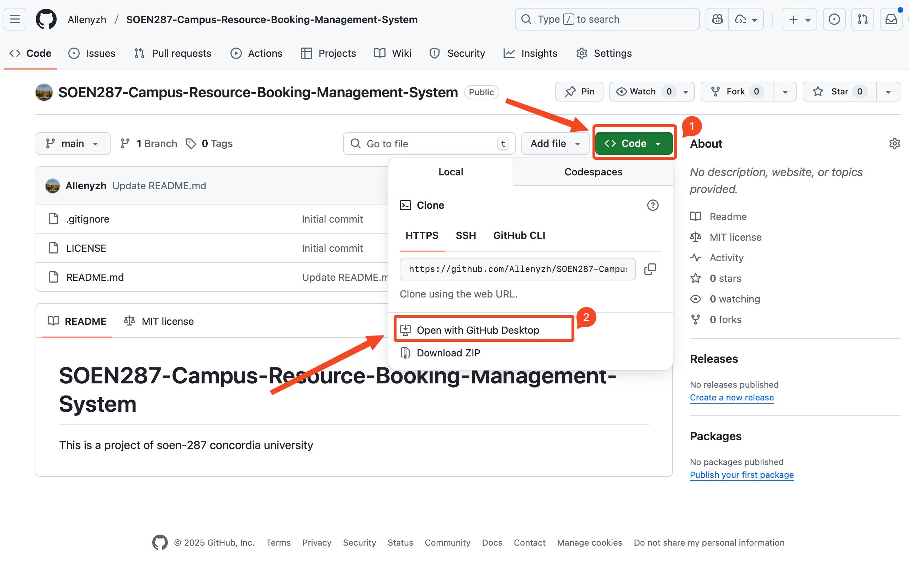

# SOEN287 Campus Resource Booking Management System

## 代码协作

- 每个提交需要新建 Branch，并创建 Pull Request，这样可以看到每个人做的内容，同时可以有效的处理代码冲突

---

## 功能特点

- **实时预约卡片**：展示资源可用性，突出实时预订体验。
- **响应式导航**：桌面端横向导航 + 移动端抽屉菜单，所有链接共用同一数据源，易于维护。
- **信息展示组件**：`DisplayCard`、`Features`、`Resource` 等组件均为数据驱动，可重复复用。
- **现代化界面**：采用 Tailwind CSS + shadcn/ui

---

## 技术栈

- [Next.js 15](https://nextjs.org/)（App Router）
- [React 19](https://react.dev/)
- [TypeScript](https://www.typescriptlang.org/)
- [Tailwind CSS 4](https://tailwindcss.com/)
- [shadcn/ui](https://ui.shadcn.com/) 组件库
- [pnpm](https://pnpm.io/) 作为推荐的包管理器

---

## 环境准备

1. **安装 Node.js（推荐 LTS 版本 ≥ 20）**

   - 前往 [nodejs.org](https://nodejs.org/) 下载并安装。
   - 安装完成后，在终端（macOS 的 Terminal 或 Windows 的 PowerShell）输入：

     ```bash
     node -v
     npm -v
     ```

     若能看到版本号，说明安装成功。

2. **安装 pnpm（推荐）**

   - 在终端输入：

     ```bash
     npm install -g pnpm
     ```

   - 验证：

     ```bash
     pnpm -v
     ```

   - 如果你更习惯 npm / yarn 也可以，但文档默认使用 pnpm。
     > ps: pnpm 包管理器比 npm 更省磁盘空间

3. **准备一个 Git 客户端（可选）**
   - 推荐使用 github desktop [Github Desktop](https://desktop.github.com/download/)

---

## 本地启动步骤

下面的命令适用于 macOS 的 `zsh`，Windows 用户在 PowerShell 中执行同样的命令即可。

1. **克隆仓库（或解压 ZIP）**

   - 如果安装了 github desktop，点击
     

2. **安装依赖**

   ```bash
   pnpm install
   ```

3. **启动开发服务器**

   ```bash
   pnpm dev
   ```

4. **访问项目**

   - 默认地址是 <http://localhost:3000>

5. **停止开发服务器**
   - 在运行命令的终端中按 `Ctrl + C`

---

## 项目结构导览

```text
SOEN287-Campus-Resource-Booking-Management-System
├── public/                     # 静态资源
│   └── *.svg
├── src/
│   ├── app/                    # Next.js App Router 入口
│   │   ├── page.tsx            # 首页
│   │   ├── layout.tsx          # 全局布局
│   │   └── globals.css         # 全局样式
│   ├── components/
│   │   ├── home/
│   │   │   ├── DisplayCard.tsx # 通用卡片组件
│   │   │   ├── Features.tsx    # 功能板块
│   │   │   ├── Resource.tsx    # 资源列表
│   │   │   ├── SideDrawer.tsx  # 移动端抽屉导航
│   │   │   └── nav.tsx         # 顶部导航
│   │   └── ui/                 # shadcn/ui 组件封装
│   └── lib/
│       └── utils.ts            # 工具函数
├── next.config.ts              # Next.js 配置
├── package.json                # 项目信息与脚本
└── tsconfig.json               # TypeScript 配置
```

---

## 常见问题排查

| 问题描述                         | 解决方案                                                                                                                            |
| -------------------------------- | ----------------------------------------------------------------------------------------------------------------------------------- |
| `pnpm` 命令不存在                | 先执行 `npm install -g pnpm` 安装全局 pnpm                                                                                          |
| 浏览器访问局域网地址时报跨域错误 | 打开 `next.config.ts`，在 `allowedDevOrigins` 中加入对应的 `http://IP:端口`，保存后重启 `pnpm dev`                                  |
| 端口 3000 被占用                 | 修改启动命令：`pnpm dev -- --port 3001`，然后访问 `http://localhost:3001`                                                           |
| TypeScript 报错或语法高亮异常    | 确认 VS Code 安装了官方的 **TypeScript + JavaScript Language Features** 插件，并使用工作区内的 TypeScript（VS Code 会在状态栏提示） |

---

## 参与贡献

---

## 资源文档

- [Next.js 官方文档](https://nextjs.org/docs)
- [React 官方文档](https://react.dev/learn)
- [Tailwind CSS Docs](https://tailwindcss.com/docs)
- [shadcn/ui 教程](https://ui.shadcn.com/docs)
